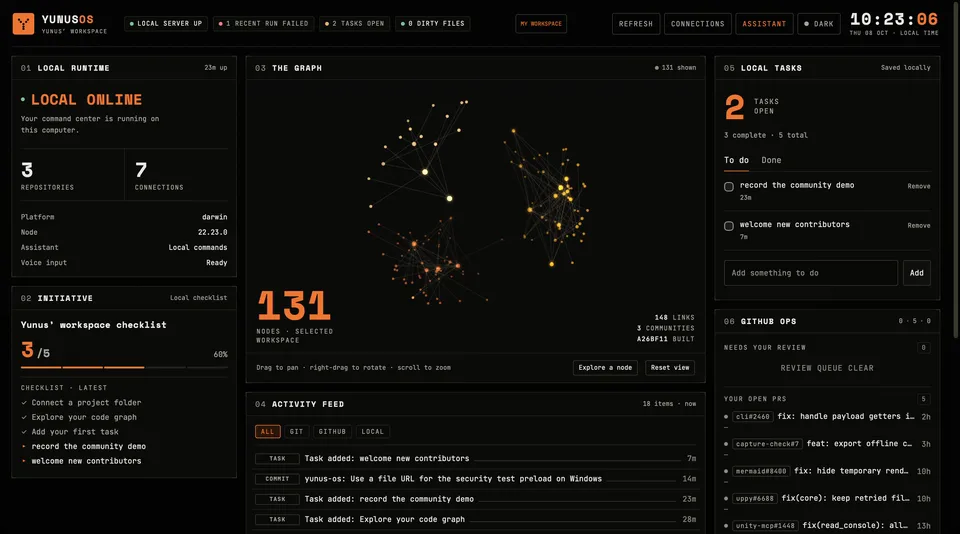

# Yunus OS

A local workspace for your projects, GitHub activity and daily tasks, with an optional voice assistant.

Yunus OS started as my personal dashboard. This public version keeps its interactive code graph and compact console interface, while giving each person their own configuration. It starts with clearly labeled demo data. The browser demo needs no account, API key or installation.

[](https://github.com/MohammediYunus/yunus-os/releases/download/v0.1.0/yunus-os-community-1080p.mp4)

[Watch the demo with sound](https://github.com/MohammediYunus/yunus-os/releases/download/v0.1.0/yunus-os-community-1080p.mp4): a real workspace, a spoken assistant reply, and a task saved after approval.

## Try it

**[Open the browser demo](https://MohammediYunus.github.io/yunus-os/)** to explore a fictional workspace, browse the graph, ask for a summary and try tasks. Tasks and the optional read-aloud preference stay in browser storage. If storage is unavailable, the app labels edits as temporary.

The browser demo uses built-in commands, not an AI model. It cannot connect accounts, read local projects, record a microphone or open desktop apps. Use the local app below for those supported integrations.

### Run on your computer

Install [Node.js 22 or newer](https://nodejs.org/), then:

```sh
git clone https://github.com/MohammediYunus/yunus-os.git
cd yunus-os
npm start
```

Open the local URL printed in your terminal. Leave that terminal running while using the dashboard. Stop it with Ctrl+C.

There are **no runtime npm dependencies**. The default demo uses bundled fonts and generated sample data, and does not contact providers or start assistant processes. It is a useful way to explore the interface before connecting anything.

### Your first workspace

Use the Yunus OS folder you just cloned to try a real project. This walkthrough uses the built-in local assistant and needs no account or API key.

1. Open **Connections**. Under **Show**, choose **My workspace**, then enter the absolute path of your cloned Yunus OS folder in **Repository folders**.
2. Keep **Provider** set to **Local workspace commands**. Click **Save connections**, then **Close** to see your repository status and code graph.
3. Open **Assistant**, select **Give me a workspace summary**, then click **Send** to get a summary of your connected workspace.
4. Type **Add a task: review the release checklist** and click **Send**. Click **Approve: Add task: review the release checklist**, then **Close** to see the saved task in **Local tasks**.

## Updating

For a Git checkout, stop the running server with Ctrl+C, then run:

```sh
git pull --ff-only
npm start
```

If you downloaded a source archive, extract the new version into a separate folder and start it there. By default, settings and tasks stay in **~/.config/yunus-os**. If you use **YOS_CONFIG_DIR**, keep the existing profile directory and use its absolute path when starting from another folder. A relative path such as **./profile** points somewhere different after you change folders. Keep your **YOS_PORT** value when restarting too.

For the optional macOS wrapper, quit **Yunus OS Community** and stop any separate Yunus OS server on its port. Move the previous **dist/Yunus OS Community.app** aside, then run **bash scripts/build-macos.sh** again. The wrapper can reuse a running community server, so quitting only the window does not update a server you started separately.

## Make it yours

Open **Connections** in the dashboard to configure your display name and choose **My workspace** for live data. Connect only the sources you want:

| Source | What you configure | What it does |
| --- | --- | --- |
| Local projects | Absolute paths to your own project folders | Reads file relationships and local Git status. It does not push, pull, commit or modify the selected repositories. |
| GitHub | Your username and selected owner/repository names | Reads project activity through the GitHub API. A token is optional for public data; private repositories require your own suitably scoped token. |
| Tasks | Add tasks in the dashboard | Stores your checklist on this computer. These are local tasks, not mailbox or GitHub writes. |
| Assistant | Start with the built-in local provider | Answers supported workspace questions without a model account. Optional Ollama or Claude CLI support uses the provider you configure. |
| Voice | Optional local Whisper installation and model | Transcribes recordings on this computer. Spoken output uses native macOS speech or an installed local browser voice. |

Demo and live data are distinguished in the interface. A disabled or failing connector stays visibly disabled or failed; it does not silently fill the panel with sample activity.

If GitHub stops responding after a successful refresh, its panel keeps that last result and shows when it was updated. Retry when the connection is available. This snapshot stays in memory only while the local server runs and is cleared when the GitHub account, token, repository selection or workspace mode changes. Stale results are excluded from current CI status and assistant summaries. Local tasks remain available while the local server is running.

The live graph shows selected files, folders and supported import relationships. It is an explorable project map, **not a complete semantic dependency analysis** for every language. A large graph in demo mode represents a fictional workspace.

Multiline JS/TS imports and re-exports are included. When a relative .js, .mjs or .cjs path has no selected literal file, the map also looks for its TypeScript source counterpart. Literal files take precedence; the graph does not read tsconfig aliases or reproduce the compiler's full resolution rules.

Git is required for Git repository information. GitHub configuration does not read your GitHub CLI login or switch any account. Optional providers require their own installed tools and configuration; they do not become available merely because the demo works.

## Assistant and voice

The default local assistant works with the workspace data already available to Yunus OS. If you choose Ollama or Claude CLI, review that provider's setup and usage terms. An external provider can receive the messages and context explicitly sent to it, and your provider account may incur usage or consume a subscription allowance. Initial launch, browsing the demo and saving provider settings do not start provider processes. Sending a request to a configured provider does, including when the workspace uses demo data.

The Claude option requires **Claude Code 2.1.248 or newer**, installed and signed in separately. That minimum supports the restricted, text-only invocation used here. An older or missing executable produces a setup error; Yunus OS does not bypass its permissions or sign in for you. Ollama requires a running local Ollama server and an already-installed model name.

Each provider keeps its own model choice. **Claude model (optional)** can stay blank to use Claude Code's default, or contain a Claude model name or alias. Switching providers preserves both choices without passing your Ollama model to Claude.

When upgrading an older profile, a saved model is kept with the provider selected in that profile. If Claude was selected, the old model appears in **Claude model (optional)**; clear it and save to return to the default. Older profiles stored only one model value, so an earlier accidental carryover cannot be distinguished from an intentional Claude override. Profiles saved with Local selected retain that value for Ollama and leave Claude's choice blank.

For hand-edited settings or API updates, **assistant.model** is the Ollama model and **assistant.claudeModel** is the Claude override. Legacy Claude profiles migrate when loaded; callers sending updates at runtime must use **assistant.claudeModel** to change Claude.

Try **Add a task: review the release checklist** with the local assistant. It proposes the task first; the task is saved only after you click its approval button. Titles can be up to 240 characters. External model replies cannot create tasks or execute app-opening actions.

Local Whisper needs an installed executable and a model file you supply. Downloading a model and installing optional tools are separate steps; Yunus OS does not silently download them. Microphone access is requested when you use recording. Browser and operating-system support varies.

On Windows, install the native executables and add their folders to PATH, or set their absolute paths in Connections. The default names find claude.exe and whisper-cli.exe automatically. Native .com programs are also supported; .cmd, .bat, PowerShell and npm shell wrappers cannot be used as provider executables. Yunus OS launches providers directly without a command shell.

The first public release supports approved app-opening actions. **It does not ship an autonomous computer operator** that clicks around your desktop. It has no email integration, mailbox actions or email draft creation.

## Configuration and privacy

The server listens only on the loopback interface. Keep it local; putting it behind a public proxy or binding it to your network is not a supported deployment.

Configuration is stored outside this repository, under ~/.config/yunus-os by default. The server applies private directory and file permissions on systems that support POSIX modes. GitHub tokens remain on the server and are omitted from browser API responses. The dashboard only receives a flag indicating whether a token has been saved.

To isolate another profile or choose a port:

```sh
YOS_CONFIG_DIR=/path/to/my-yunus-profile YOS_PORT=4143 npm start
```

PowerShell:

```powershell
$env:YOS_CONFIG_DIR = "$env:LOCALAPPDATA\YunusOS\profile"
$env:YOS_PORT = "4143"
npm start
```

Your selected source folders are read by the local server. Connect trusted local projects only: Git can honor repository and user configuration, including configured filters. This is not a sandbox for inspecting unknown repositories. Do not connect a folder or account whose contents you do not want shown in this local workspace. Local configuration is not encrypted at rest; protect your operating-system account and disk. See [security boundaries](docs/security.md) for details.

To reset, stop the app and remove the profile directory you selected, or the default ~/.config/yunus-os directory. This removes Yunus OS settings, saved credentials and local tasks. It does not delete your selected source projects or change your GitHub account. Revoke a GitHub token separately in GitHub if you no longer need it.

## Platform support

The dashboard runs in a browser on macOS, Linux and Windows with Node.js 22 or newer. Voice and app-opening capabilities are platform-specific and reported by the app. Local projects need Git installed.

On macOS, the optional native wrapper can be built with Xcode command line tools:

```sh
bash scripts/build-macos.sh
```

This creates a separate **Yunus OS Community.app** under dist. It does not install or replace another application. Node.js is still required. The bundle is signed locally with an ad-hoc signature; it is not Developer ID signed or notarized, and has no automatic updater. The browser dashboard remains the standard starting point.

## Development

```sh
npm test
npm run build:demo
```

The second command exports the browser demo to dist/browser-demo using an explicit list of presentation files and synthetic fixtures. Serve that directory with a static web server. Assets work at either the site root or a project subpath such as /yunus-os/. The local Node server and connection settings are excluded.

The Browser demo workflow deploys that artifact to GitHub Pages from main. Forks can build it locally or enable their own Pages site with GitHub Actions as the source. The local server itself must remain on loopback.

Tests use synthetic fixtures, temporary profiles and mocked external services. Security tests start the actual server with an empty home directory and block outbound network and child-process activity in demo mode. They exercise session authentication, origin and host checks, request size limits, static-file boundaries and credential redaction.

Please read [CONTRIBUTING.md](CONTRIBUTING.md) before sending a change and [SECURITY.md](SECURITY.md) before reporting a vulnerability. Small, well-tested fixes and improvements to setup, accessibility and supported connectors are welcome.

## License and provenance

Code is licensed under [MIT](LICENSE), copyright 2026 Yunus. The presentation was adapted from my own Yunus OS dashboard; this repository is a clean public version without the original private history, operational data or account configuration.

Space Mono and JetBrains Mono are bundled under their respective SIL Open Font Licenses. Their copyright and license notices are in [assets/fonts](assets/fonts). Those fonts retain their original licenses.
